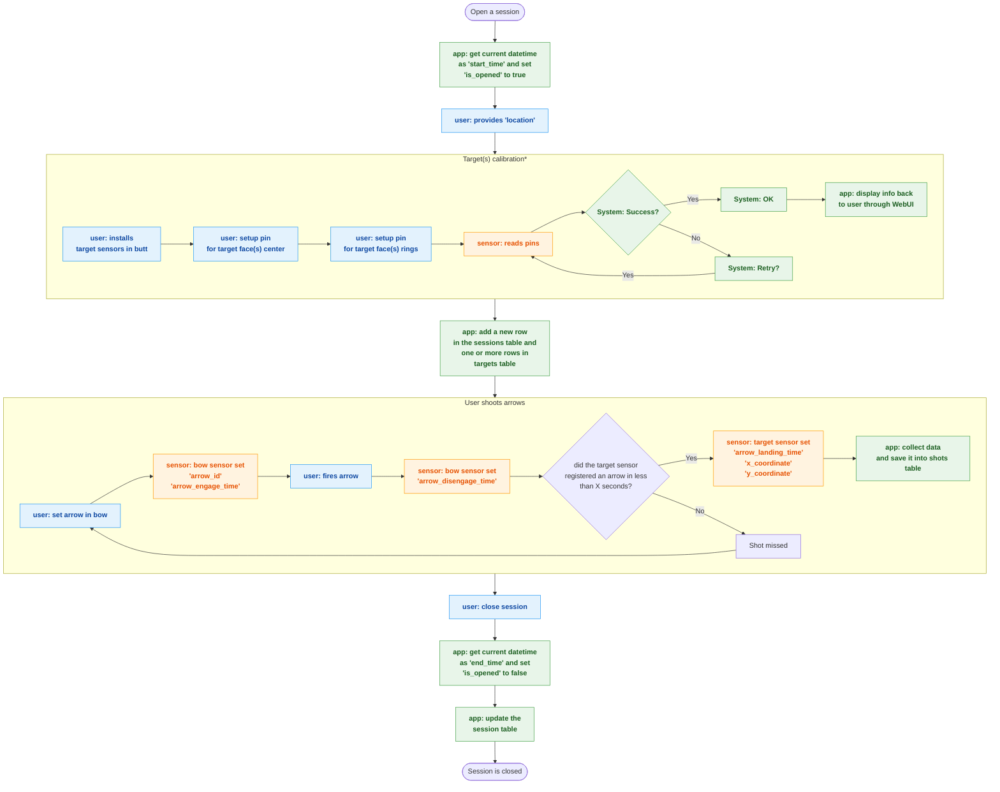

# Arch Stats: Analyzing Archery Performance Through Data

## 1. Introduction

### 1.1 Background

Practicing archery can feel inconsistent: some days, I see improvement; other days, it feels like I’ve hit a plateau—or even regressed. Tracking performance is challenging due to the numerous variables influencing each shot.

### 1.2 The Problem

I need a method to objectively measure and track my archery performance over time.

### 1.3 The Solution

The Arch Stats app will provide a comprehensive platform to:

* Identifying measurable variables that impact performance.
* Consistently collect data on these variables using specialized hardware.
* Record the data in a structured database.
* resent the information in an intuitive, actionable format through a WebUI.

### 1.4 Goals

* Provide objective insights into archery performance.
* Identify areas for improvement.
* Track progress over time.

### 1.5 Constraint

* The app will track only one archer.
* The archer will have only one bow with a fixed bow weight.
* The archer will have a fixed draw length.
* The archer will be shooting in the same lane within a session.
* The archer will be shooting at the same distance within a session.
* There will be only one session open at the time.

## 2. Requirements

### 2.1 Functional Requirements

* **Data Acquisition:**
  * Capture arrow variables (weight, length, identifier, spine, diameter).
  * Capture shooting variables (arrow engage time, arrow disengage time, arrow landing time, X coordinate, Y coordinate).
  * Capture session variables (distance, max X coordinate, max Y coordinate, location, start/end time).
* **Data Management:**
  * Store all data in a PostgreSQL database.
  * Provide CRUD (Create, Read, Update, Delete) operations for arrows, sessions, and shots.
* **User Interface:**
  * Allow the user to register arrows.
  * Allow the user to open and close sessions.
  * Visualize shot data in real-time and over time.
  * Display key performance indicators (KPIs).
* **Hardware Integration:**
  * The arch stat app will run in a Raspberry Pi 5.
  * There will be a sensor (Bow Reader) attached to the archer's bow. The type of sensor is TBD.
  * There will be a sensor (Arrow Reader) attached to the Raspberry Pi. The type of sensor is TBD.
  * There will be a sensor (Target Reader) attached to the Raspberry Pi. The type of sensor is TBD.
  * Communicate with the Arrow Reader to assign IDs to arrows.
  * Receive shot data from the Bow Reader and Target Reader.

### 2.2 Non-Functional Requirements

We'll come up with some metrics later on to measure the following points:

* **Performance:** The system should provide near real-time feedback on shots.
* **Reliability:** The system should be reliable and minimize data loss.
* **Usability:** The user interface should be intuitive and easy to use.
* **Maintainability:** The codebase should be well-organized and easy to maintain.

## 3. System Architecture

Since I'm developing this app by myself, I have decided to use python workspace, multi module in a monorepo in order to simply the development process.

### 3.1 Modules

The system will consist of the following modules:

* **WebUI:** Provides the user interface for data visualization and interaction.
* **Web Server:** Acts as the central coordinator, handling data flow and communication between modules.
* **Database:** Stores all application data.
* **Arrow Reader:** Reads and assigns unique identifiers to arrows.
* **Bow Reader:** Captures arrow engage and disengage times.
* **Target Reader:** Captures arrow landing time and coordinates on the target.

### 3.2 Data Flow Diagram

Data will be collected through 3 entities:

* App (Software)
* Sensors (Hardware)
* User input

The following flow charts show how the 3 entities interact with each other.

#### 3.2.1 Arrow Registration


#### 3.2.2 Sessions &amp; Shots flow



### 3.3 Module Details

#### 3.3.1 WebUI

* **Technology:** Vanilla TypeScript, HTML, CSS.
* **Hardware:** Raspberry Pi 5
* **Responsibilities:**
  * User interface for arrow registration, session management, and data visualization.
  * Real-time display of shot data via WebSockets.
  * Historical data filtering and analysis through charts.
* **UI Elements:**
  * Arrow registration form.
  * Session start/end controls.
  * Data visualizations (scatter plots, time series, etc.).
  * Dashboard with KPIs.
* **Future Considerations:**
  * Allow multiple users to use the app at the same time.
  * Support tournaments
  * User authentication/authorization.
  * More advanced data analysis tools.

#### 3.3.2 Web Server

* **Technology:** Python with FastAPI, Pydantic, SQLAlchemy
* **Hardware:** Raspberry Pi 5
* **Responsibilities:**
  * API endpoints for data access (arrows, sessions, shots).
  * WebSocket communication with the WebUI for real-time updates.
  * Coordination of the Arrow Reader.
  * Data validation and error handling.
  * Database interaction.
* **API Endpoints:**
  * shot
    * GET /shot?start_date=SOME_DATE&end_date=SOME_DATE_OR_NOW (get shots by sessions start/end date)
    * GET /shot (gets all shots)
    * DELETE /shot/{shoot_id}
  * target
    * GET /target?session=SESSION_ID (get targets by session_id)
    * GET /target (get targets all targets)
    * POST /target (returns new target UUID)
    * DELETE /target/{target_id}
    * PATCH /target/{target_id}
  * session
    * GET /session?open=True (gets the open session)
    * GET /session (gets all sessions)
    * POST /session (returns new session UUID)
    * DELETE /session/{session_id}
    * PATCH /session/{session_id}
  * arrow
    * GET /arrow?arrow_id=ARROW_ID
    * GET /arrow (gets all arrows)
    * POST /arrow (returns new arrow UUID)
    * DELETE /arrow/{arrow_id}
    * PATCH /arrow/{arrow_id}
* **WebSockets:**
  * `arrow_id`: Sends the assigned arrow ID from the Arrow Reader to the WebUI.
  * `shot_information`: Sends shot data from the Web Server to the WebUI.
* **Error Handling:**
  * Logging of errors.
  * Appropriate HTTP status codes.
  * Potential for alerts (future).
* **Data Validation:**
  * Validate data types and ranges.
  * Handle missing or invalid data.

#### 3.3.3 Arrow Reader

* **Technology:** Python
* **Hardware:** TBD
* **Responsibilities:**
  * Listens for a signal from the hardware when an arrow is presented.
  * Generates a unique UUID for the arrow.
  * Writes the UUID to the arrow's TBD.
  * Sends the UUID to the Web Server via a WebSocket.
* **Process:**
  1. Infinite loop waiting for arrow presentation.
  2. Generate UUID.
  3. Write UUID to arrow sticker.
  4. Send UUID to Web Server.
* **Error Handling:**
  * Handle hardware read/write errors.
  * Log errors.

#### 3.3.4 Bow Reader

* **Technology:** Python
* **Hardware:** TBD
* **Responsibilities:**
  * Detects arrow engage time.
  * Detects arrow disengage time.
  * Sends the timestamps to the Web Server.
* **Data Acquisition:**
  * [Describe the specific process of how the sensors capture the data and how it's processed.]
* **Calibration:**
  * [Describe the calibration process for the sensors.]
* **Synchronization:**
  * [Explain how the Bow Reader's timestamps are synchronized with the Target Reader (e.g., using a shared timestamp or a synchronization signal).]
* **Error Handling:**
  * Sensor failures.
  * Communication errors.

#### 3.3.5 Target Reader

* **Technology:** Python
* **Hardware:** TBD
* **Responsibilities:**
  * Detects arrow landing time.
  * Determines the X and Y coordinates of the arrow impact.
  * Sends the data to the Web Server.
* **Image/Data Processing:**
  * [Describe the image or data processing techniques used to identify the arrow impact.]
  * [Explain how the X and Y coordinates are calculated and calibrated.]
* **Missed Shot Detection:**
  * If no arrow landing time is detected within a specified time frame, the shot is marked as missed, and X/Y coordinates are set to null.
* **Calibration:**
  * [Describe the calibration process for the target (e.g., camera calibration, coordinate system calibration).]
* **Synchronization:**
  * [Explain how the Target Reader's data is synchronized with the Bow Reader (e.g., using a shared timestamp or a synchronization signal).]
* **Error Handling:**
  * Image processing errors.
  * Communication errors.

#### 3.3.6 Database

* **Technology:** PostgreSQL
* **Responsibilities:**
  * Stores all application data (arrows, sessions, shots).
  * Ensures data integrity and consistency.
  * Provides efficient data retrieval.
* **Schema:**
  * **arrows**

    ```sql
    CREATE TABLE IF NOT EXISTS arrows (
        id UUID PRIMARY KEY,
        weight REAL DEFAULT 0.0,
        diameter REAL DEFAULT 0.0,
        spine REAL DEFAULT 0.0,
        length REAL NOT NULL,
        human_identifier VARCHAR(10),
        label_position REAL NOT NULL,
        is_programmed BOOLEAN NOT NULL DEFAULT FALSE,
        UNIQUE (human_identifier)
    );
    ```

  * **sessions**

    ```sql
    CREATE TABLE IF NOT EXISTS sessions (
        id UUID PRIMARY KEY,
        is_opened BOOLEAN NOT NULL,
        start_time TIMESTAMP WITH TIME ZONE NOT NULL,
        end_time TIMESTAMP WITH TIME ZONE,
        location VARCHAR(255) NOT NULL,
        CONSTRAINT open_session_no_end_time CHECK (
            (is_opened = TRUE AND end_time IS NULL) OR (is_opened = FALSE)
        ),
        CONSTRAINT closed_session_with_end_time CHECK (
            (is_opened = FALSE AND end_time IS NOT NULL) OR (is_opened = TRUE)
        )
    );
    ```

  * **shots**

    ```sql
    CREATE TABLE IF NOT EXISTS shots (
        id UUID PRIMARY KEY,
        arrow_id UUID NOT NULL,
        arrow_engage_time TIMESTAMP WITH TIME ZONE NOT NULL,
        arrow_disengage_time TIMESTAMP WITH TIME ZONE NOT NULL,
        arrow_landing_time TIMESTAMP WITH TIME ZONE,
        x_coordinate REAL,
        y_coordinate REAL,
        FOREIGN KEY (arrow_id) REFERENCES arrows (id) ON DELETE CASCADE
    );
    ```

  * **targets**

    ```sql
    CREATE TABLE IF NOT EXISTS targets (
        id UUID PRIMARY KEY,
        max_x_coordinate REAL NOT NULL,
        max_y_coordinate REAL NOT NULL,
        radius REAL [] NOT NULL,
        points INT [] NOT NULL,
        height REAL NOT NULL,
        human_identifier VARCHAR(10),
        session_id UUID NOT NULL,
        CHECK (array_length(radius, 1) = array_length(points, 1)),
        UNIQUE (session_id, human_identifier),
        FOREIGN KEY (session_id) REFERENCES sessions (id) ON DELETE CASCADE
    );
    ```

* **Database Scripts:**
  * Scripts for creating and updating the database schema.
  * Scripts for initial data setup (if any).
* **Connection Details:**
  * [Specify how the Web Server and other modules will connect to the database (e.g., connection string, credentials).]

#### 3.3.7 Testing

* Python unit tests using pytest for:
  * Arrow Reader module.
  * Bow Reader module.
  * Target Reader module.
  * Web Server module.
* TypeScript unit tests using Jest for the WebUI module.

## 4. Development Plan

The core application logic, API, and WebUI will be built using **dummy data** to simulate input from the hardware sensors. Once the software is stable, the focus will shift to define and integrate the actual hardware to be used as sensors.
