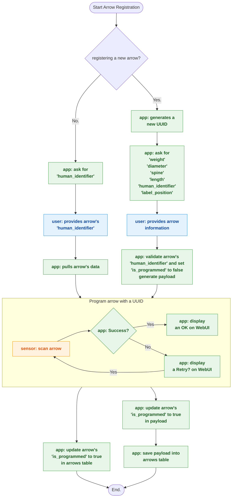
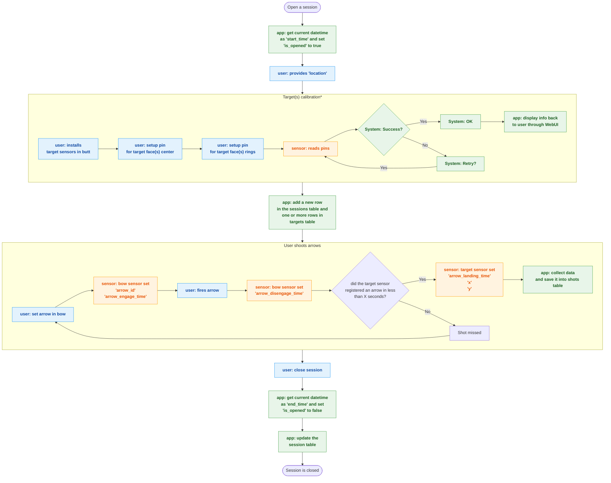

# Arch Stats: track and understand your archery performance over time

**Archery can feel inconsistent.** Some days every shot hits the mark; other days, you struggle to replicate your past performance. With so many factors affecting each shot (form, equipment, fatigue, environment), it’s hard to know if you’re truly improving or what you need to work on. **Arch Stats** is a tool that takes the guesswork out of tracking progress. It **collects data from your shooting sessions and presents clear insights** so you can objectively measure your performance and consistency over time. By recording each arrow and each shot, Arch Stats helps identify areas for improvement and keeps you motivated as you see your progress in real numbers.

## Key Features

* **Progress Tracking:** Every practice session and shot is logged, allowing you to **track your improvement over days, months, and years**. You can see objective trends in your accuracy and consistency, rather than relying on gut feeling. This helps you understand if you’re plateauing or making steady gains.
* **Visual Charts & Graphs:** Arch Stats provides instant visual feedback on your shooting. **Scatter plot charts** show where your arrows land on the target, helping you analyze grouping and precision. **Line graphs** illustrate trends (like your accuracy or shot timing) across multiple sessions. All charts update in real-time as you shoot, so you get immediate insights after each arrow.
* **Performance Analysis Tools:** The app includes built-in tools to help you analyze your performance. You can filter and query your shot data to spot patterns and trends. For example, compare performance between different practice sessions, see how your accuracy varies at different distances, or even evaluate if a particular arrow consistently flies differently from the rest. These **pre-set analyses** make it easy to uncover trends without needing any technical skills.
* **Data Export:** Your data is yours. Arch Stats lets you **export all your raw data in CSV format**, so you can open it in Excel or other programs. This is great if you want to do custom analysis or keep a personal log. You can back up your entire shooting history or share it with a coach in a universally readable format.

> **Note:** *Currently, Arch Stats is designed for **a single archer** using one bow. Each session assumes one archer, one bow setup, and consistent conditions (the same target distance and lane). Support for multiple archers and more complex scenarios is in the works, but the current focus is on personal tracking for an individual archer.*

## How It Works

Arch Stats combines a friendly web application with electronic sensors on your equipment to seamlessly record data with minimal effort from you. The system runs on a small computer (such as a Raspberry Pi) connected to three types of sensors:

* An **Arrow Reader** to assign a unique ID to each arrow (so the system knows exactly which arrow you just shot).
* A **Bow sensor** to detect when you draw and release an arrow.
* A **Target sensor** to detect when and where the arrow hits the target.

Using these components, Arch Stats tracks the entire lifecycle of a shot. There are two main parts to using Arch Stats: first **registering your arrows**, and then **recording a shooting session**.

### Arrow Registration

Before you start logging practice sessions, you’ll register all your arrows in the system. This process gives each arrow its own unique identifier and stores its characteristics (weight, length, spine, etc.). Arch Stats will guide you through entering these details via the web interface. Each arrow is then **programmed with a small tag or code** (using the Arrow Reader sensor) so that the system can recognize that arrow every time you shoot it. This way, you can later see if certain arrows perform differently from others.

The flowchart below shows how the arrow registration process works in Arch Stats:

### Sessions & Shots

Once your arrows are registered, you’re ready to record a shooting session. A **session** represents a practice session or round of shooting. Using the Arch Stats web app, you **open a new session** when you start shooting. You’ll be prompted to enter the session details like the shooting location and distance to target (this provides context for your data). If it’s the first time using a particular target or setup, you may also calibrate the target sensor so the system knows the target’s dimensions (e.g. where the center and scoring rings are).

After that, you simply shoot as you normally would. **Every time you shoot an arrow:**

* The bow sensor detects the moment you draw and release the arrow (recording events like “arrow engaged” and “arrow released”).
* The target sensor detects the arrow hitting the target, recording the exact time of impact and the location (coordinates) of the hit on the target face.
* The system automatically links this information with the specific arrow you shot (thanks to the arrow’s ID) and creates a new entry in the database for that shot.

If an arrow misses the target, the system notes it as a miss (no impact recorded within a short time window). Throughout the session, you can glance at the web interface to see your shots plotting in real-time on a virtual target and key stats updating live. This immediate feedback can help you adjust during practice.

When you finish shooting, you **close the session** in the app. The system will mark the session as completed and log the end time. All the data — each shot’s time, its hit position, which arrow was used, etc. — is now saved for you to review later.

The flowchart below illustrates the lifecycle of a session and how shots are recorded in Arch Stats:

## Reviewing Your Performance

After your sessions are recorded, Arch Stats really shines in helping you make sense of the data. The **dashboard** in the web app gives you a clear overview of your performance. You can see summary statistics for a session (like number of shots, hits vs. misses, etc.), and key performance indicators such as your average shot spacing or consistency. The data visualization tools let you dive deeper:

* **Target Maps:** For each session, you can view a scatter plot of your arrow impacts on a target diagram. This shows your grouping and spread, so you can identify patterns (for example, are your shots clustering low and left?).
* **Timeline Graphs:** Arch Stats can plot metrics over time – for instance, tracking your average score or group size across all sessions, so you can see long-term trends. Did your form change lead to improvement over several weeks? The charts will show you.
* **Session Comparison:** You can compare one session to another. By filtering your data (e.g. by date range or by the specific bow or arrow used), you might discover insights such as *“I shoot more consistently at 18m than at 30m”* or *“My second practice session of the day tends to have tighter groupings than the first.”* The app’s built-in queries make it easy to get these answers without manual calculations.
* **Arrow-specific Insights:** Because Arch Stats knows each arrow by its ID, you can evaluate the performance of individual arrows. For example, you might find that **Arrow #7** consistently lands a bit high – indicating it might be slightly different or damaged compared to your others. This level of detail helps you fine-tune your equipment and ensure consistency.

And remember, if you want to perform any analysis not directly supported in the app, you can always export your data and analyze it however you like. **By having all your shots logged and accessible, you can base your training decisions on real evidence rather than hunches.** The end result is a clearer understanding of your strengths and weaknesses as an archer, and a record of progress you can look back on.

## Future Plans

Arch Stats is an active project, and there are exciting enhancements on the horizon. Planned improvements include:

* **Multi-Archer Support:** In the future, Arch Stats will allow multiple archers to use the system (for example, a coach tracking data for several students, or multiple team members using one setup). This will likely include user profiles or accounts so each archer’s data stays separate.
* **Tournament/Scoring Features:** Beyond practice sessions, the system aims to support scoring formats for competitions or scoring rounds. This means you could use Arch Stats in a tournament setting to log arrow scores and analyze performance under pressure.
* **Advanced Analytics:** More sophisticated analysis tools are in development, such as automatic grouping size calculations, trend predictions, and integration with scoring zones to calculate scores (if you use standard target faces). The goal is to continue providing archers with **actionable insights** that go beyond simple record-keeping.

**Arch Stats is built by an archer, for archers.** It is a passion project designed to bring modern data tracking to the ancient sport of archery. By leveraging technology (in a user-friendly way), Arch Stats empowers you to make informed adjustments to your practice and equipment. Whether you’re a competitive shooter aiming for the podium or a hobbyist trying to beat your personal best, Arch Stats gives you the feedback you need to **focus your training and see real improvement over time**. Happy shooting!

## For Software Developers

If you're a developer interested in contributing to Arch Stats — whether to help expand features, integrate new sensor types, improve performance, or refine the user experience — you're very welcome! While this README focuses on the end-user experience for archers, the system is built as a modular, modern monorepo and is fully open-source.

Arch Stats is divided into two main developer domains:

### 🧠 Backend

The backend is a Python 3.13 FastAPI application that coordinates data across sessions, arrows, shots, and sensors. It uses asyncpg for PostgreSQL access, Pydantic v2 for schema validation, and WebSockets for real-time communication with the frontend.

For a complete breakdown of the backend modules (including architecture, development workflow, VS Code tasks, testing setup, and API routes), for more information read the [backend/README.md](./backend/README.md)

### 🎯 Frontend

The frontend is a TypeScript + Vue 3 + Vite application, designed for clarity and performance. It provides real-time visualizations of shot data, arrow/session forms, and performance dashboards. Prettier and ESLint are used for formatting and quality.

To learn how the WebUI is structured, how to develop with hot reload, and how it communicates with the backend, for more information read the [frontend/README.md](./frontend/README.md)

### Development Philosophy

This project is designed for **fast iteration**, **strict type checking**, and **hardware-software integration**. All core services are containerized and the monorepo includes tasks for bringing up everything with a single command. Contributions are welcome — whether you’re improving code, sensors, docs, or analytics!

If you're new, reading both the frontend and backend READMEs will give you a clear roadmap to getting started quickly.
