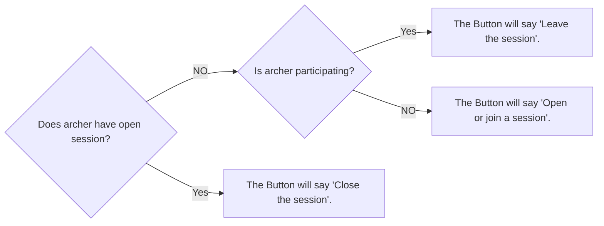
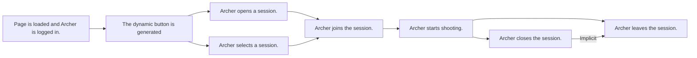

# Session Flow Feature Definition

## Overview

This feature defines the workflow for managing shooting sessions within the application. A session represents a group shooting event where archers can participate, shoot at targets, and manage their involvement. The session owner (a regular archer) is responsible for creating and closing the session, while other archers can be assigned to (aka join) open sessions.

Key assumptions:

- The archer is already logged in and authenticated.
- Sessions are tied to locations (indoor or outdoor) and involve assigning archers to targets based on distance and availability.
- The application maintains state (e.g., "remembers" session IDs) during the user's interaction flow.
- Database entities involved include: Sessions (with fields like id, owner_archer_id, created_at, closed_at, location, is_indoor, is_opened), Slot_Assignments (with fields like id, target_id, archer_id, session_id, face_type, slot_letter, created_at, is_shooting, bowstyle, draw_weight, club_id), Targets (with fields like id, session_id, distance, lane, created_at).

This document serves as a blueprint for software developers during implementation. It includes user flows, business rules, UI elements, and edge cases.

## User Roles

- **Session Owner**: The archer who creates the session. Responsibilities include:
  - Waiting for all participants to leave before closing (though the app enforces this).
  - Closing the session, which also marks them as having left.

- **Participant Archer**: Any logged-in archer who joins an open session. They provide distance and target face details and are assigned to a target/slot.

## UI Elements

### The Button (Dynamic Header Button)

- A prominent button in the header that changes label and behavior based on the archer's session status.
- Logic flowchart:

- On page load, query the database for the archer's session status to determine the button state.
- Button actions trigger the corresponding flows (e.g., "Open or join a session" leads to a modal or page for opening/joining).

### Forms and Modals

- **Open Session Form**: Fields for session location (text input) and indoor/outdoor (toggle or radio buttons).
- **Select Session Dropdown**: List of open sessions, displaying session_id, owner_archer_id (or owner's name), and created_at (formatted date/time).
- **Join Session Form**: Fields for distance (numeric input, e.g., in meters) and target face (dropdown or text, e.g., "40cm", "80cm").
- Confirmation modals for leaving or closing sessions (e.g., "Are you sure? This will end the session for all.").

## Business Rules

### Session States

- **Open**: is_opened = TRUE. Archers can join.
- **Closed**: is_opened = FALSE. No new joins; all assignments are marked as left (is_shooting = FALSE).
- Sessions cannot be reopened once closed.

### Target Assignment Rules

Slots represents positions within a target.

- Targets have lanes (sequential numbers starting from 1) and support up to 4 slots (A, B, C, D).
- Assignment logic:
  - Check for existing targets matching the archer's distance with less than 4 assigned archers.
  - If found, assign to the next available slot (A → B → C → D).
  - If not, create a new target with lane = MAX(existing lanes) + 1, distance = archer's distance, and assign to slot A.

When an archer opens a new session no targets are available, for this reason, archer owners always are assigned "1A" (Lane 1, position A)

### Data Integrity

- All timestamps use UTC.
- All created_at fields are going to be managed by the DB. So the client can't set any of these fields.
- Prevent duplicate joins: An archer cannot join nor create multiple sessions simultaneously.

## Actions and Flows

### Open a Session

1. User clicks "Open or join a session" → Render form for location and indoor/outdoor.
2. On submit:
   - Create new session record: owner_archer_id = current archer_id, is_opened = TRUE, location = input, is_indoor = input.
   - Store session_id in app memory (e.g., session storage or state management).
   - Auto-join the owner: Proceed to "Join a Session" flow, prompting for their distance and target face.
3. Postconditions: Button updates to "Close the session" if owner; session is listed for others.

### Selecting a Session to Join

1. User clicks "Open or join a session" → If no open session as owner/participant, render dropdown of all open sessions (query WHERE is_opened = TRUE).
2. Display each option as: "Session by [Owner Name] at [Location] (Started: [Formatted Date])".
3. On selection: Store selected session_id in app memory.
4. Proceed to "Join a Session" flow.

### Join a Session

we are using the term "join" and "assign" to refer to an archer that wants to shoot in a session.

1. With session_id in memory, render form for distance and target face.
2. On submit:
   - Apply "Assigning an Archer to a Target Slot" logic.
   - Create slot_assignment: archer_id = current, target_id = assigned, slot = assigned, is_shooting = TRUE.
3. Postconditions: Button updates to "Leave the session"; user can proceed to shooting.
4. Error Handling: If session closes mid-join, show error and refresh button.

### Leaving a Session

1. User clicks "Leave the session" → Confirm via modal.
2. On confirm: Update slot_assignment.is_shooting = FALSE for the archer.
3. Postconditions: Button updates to "Open or join a session"; if owner, check if all others have left before allowing close.
4. Edge Case: Owner cannot leave without closing; redirect to close if attempted.
5. Even if an archer leave a session their slot still get counted as occupied.

### Close a Session

1. Owner clicks "Close the session" → Check if any participants have is_shooting = TRUE (excluding owner).
   - If yes, show warning: "Wait for all participants to leave."
   - If no, confirm via modal.
2. On confirm:
   - Update all slot_assignments.is_shooting = FALSE for the session.
   - Set session.is_opened = FALSE.
3. Postconditions: Button updates to "Open or join a session"; session no longer listed as open.

### Assigning an Archer to a Target Slot

- Input: Archer's distance, session_id.
- Query existing targets for session WHERE distance = archer's distance AND count(assigned archers) < 4.
- If match:
  - Select the target with available slots.
  - Assign next slot (e.g., if A,B occupied, assign C).
- Else:
  - Create new target: lane = MAX(lane for session) + 1, distance = archer's.
  - Assign slot A.
- Ensure atomicity (use transactions to avoid race conditions in multi-user scenarios).

### Overall Actions Flow Chart

## Edge Cases and Error Handling

- **No Open Sessions**: Dropdown shows empty; prompt user to open a new one.
- **Session Full**: If all targets are at max capacity for a distance, still create new target (no explicit limit on targets).
- **Concurrent Joins**: Use database locks or optimistic concurrency to prevent over-assignment.
- **Invalid Inputs**: Validate form fields (e.g., distance > 0, location not empty).
- **Session Not Found**: If remembered session_id is invalid (e.g., closed), clear memory and refresh button.
- **Owner Leaves Early**: Enforce that close action handles owner's leave; direct leave button for owner triggers close prompt.
- **Network Errors**: Retry database operations; show user-friendly messages.

## Implementations

### Backend (Endpoints)

**NOTE:** only authenticated clients can use the following endpoints

GET /session/archer/{archer_id}/open-session (either the archer created session AND the session is opened or not. returns session_id or None)
GET /session/archer/{archer_id}/participating (either the archer is participating in a session or not. returns session_id or None)
GET /session/open (get all currently open sessions)

POST /session (open a new session only if the archer doesn't have any other open session already. Return 422 HTTPS response code if the archer does have an open session)
POST /slot (the archer is assigned a slot within an opened session, create target if needed)

PATCH /session/close
PATCH /slot/leave

### Frontend

WIP
